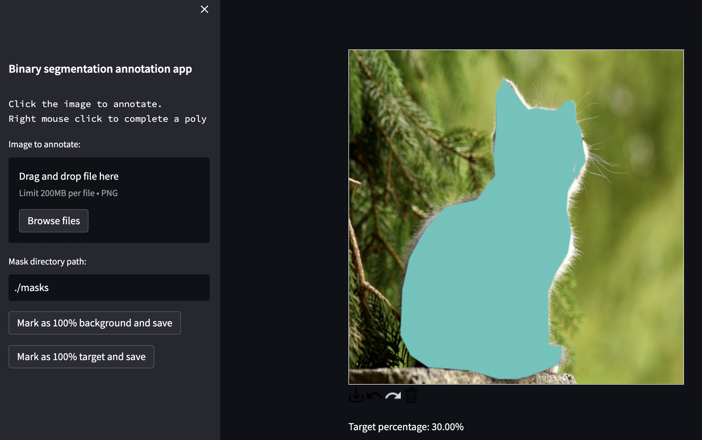

# segmentation-annotation-app
Streamlit app to perform annotation for binary segmentation. 

- Use the file picker to load an image to annotate with polygons covering target class pixels
- Save the mask file: this will use the input filename and save to the masks directory
- The generated masks are 8-bit images with 0 representing background and 255 representing target

<p align="center">

</p>

## Tips
- The file picker is used to select the image to annotate, if you are working through a long list of images it is easy to loose your place and spend lots of time searching for the next file. A workaround is to periodically move the annotated images to a folder called `annotated`, making it easier to find the unannotated images
- If you refresh the app page, be sure to update the `Mask directory path:` or masks will be saved in the default location (they can be just copied over so not a big deal)

## Development (mac)
```
python3 -m venv venv
source venv/bin/activate
pip install -r requirements.txt
streamlit run app.py
```

## References
- [streamlit-drawable-canvas](https://github.com/andfanilo/streamlit-drawable-canvas)